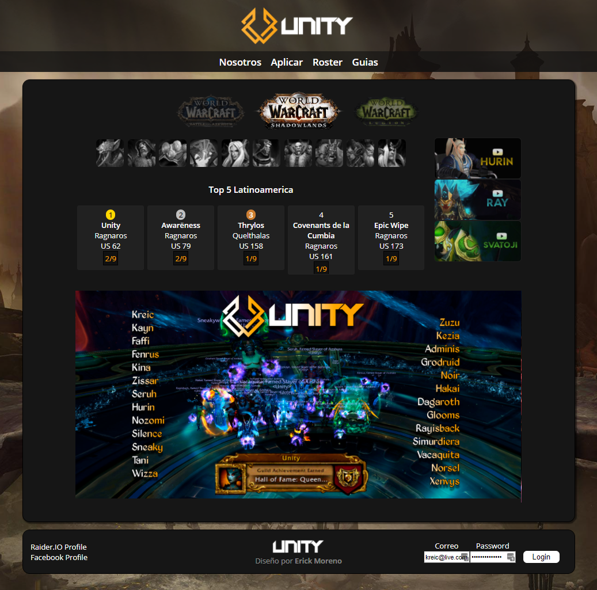
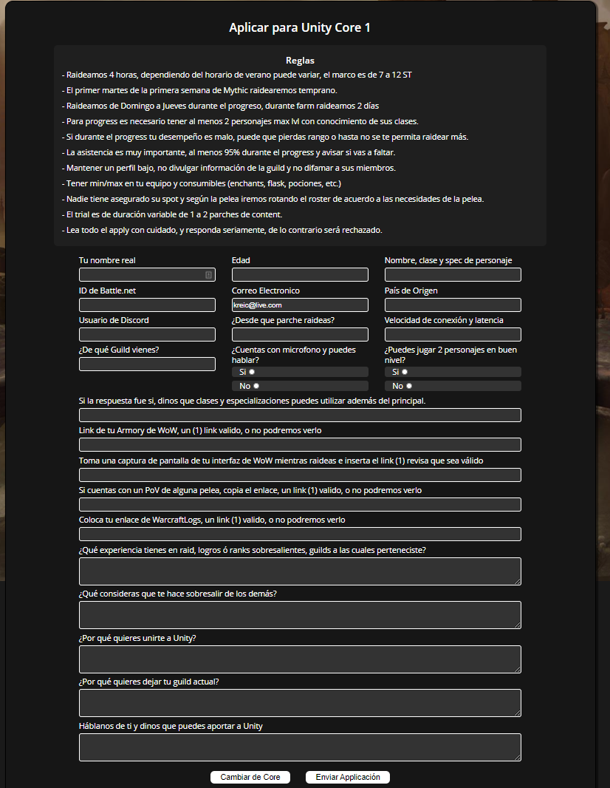
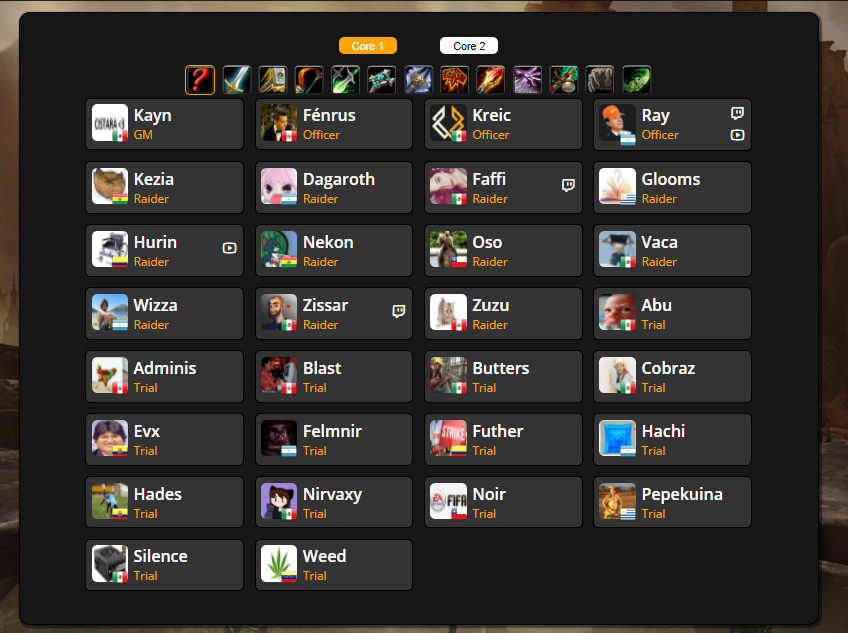
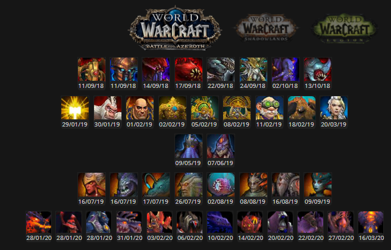

# Unity Latam

UnityLatam is a web developed to track the progress of Unity - Ragnaros Guild from the game World of Warcraft

The Site has been in development for the past 4 years, with changes to it's funcionality, appeareance and started using React two years ago.

To visit the site go to https://unitylatam.com/

## Getting Started

To install this project you will need an account in Google Firebase

### Installing

To get the env running you will need

```
git clone https://erickjmoreno@bitbucket.org/erickjmoreno/unitylatam.git
git clone giturl
```

```
npm i firebase-tools
firebase init
Follow the instructions to install firebase and log in to your account
Select the project you will use to host the web
```

Install all the dependencies in this project by

```
npm install
```

## Running the tests

This project don't have any test yet.

## Deployment

You can run the project locally by using

```
npm start
```

this will create a local server with webpack

When you finish you can build the project with

```
npm run build
```

To upload the project to firebase you use

```
firebase deploy --only hosting
```

## Built With

- [Firebase](https://firebase.google.com/docs/guides) - The hosting, auth and functions provider
- [React](https://reactjs.org/) - Framework used

## Screenshots






## Authors

- **Erick Moreno**

## License

This project is yet to be licensed
